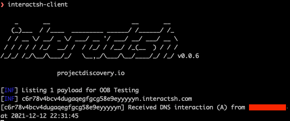
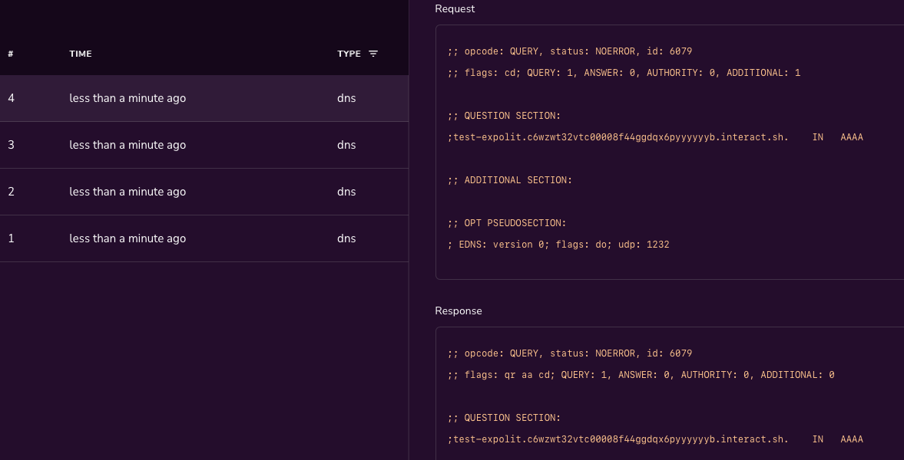

Introduction
-------------
we are providing DevOps and security teams script to identify cloud workloads that may be vulnerable to the Log4j vulnerability(log4shell) in their AWS account.
We currently support *"CVE-2021-44228"* and *"CVE-2021-45046"* RCE vulnerabilities. The script enables security teams to identify external-facing AWS assets by running the exploit on them, and thus be able to map them and quickly patch them

General Information
-------------------

- Information about CVE-2021-44228: https://nvd.nist.gov/vuln/detail/CVE-2021-44228
- Information about CVE-2021-45046: https://nvd.nist.gov/vuln/detail/CVE-2021-45046
- central updated location which outlines everything you need to know about Log4Shell: https://www.mitiga.io/blog/log4shell-everything-in-one-place
- Algorithm drill-down: https://www.mitiga.io/blog/log4shell-identify-vulnerable-external-facing-workloads-in-aws-tutorial

Features
########
* Scans the resources in all regions
* Scans all the compute resources which exposed to the internet
* Ability to execute it with a proxy
* Supporting multiple ways to configure the AWS credentials using AWS known environment variables: `<https://docs.aws.amazon.com/cli/latest/userguide/cli-configure-envvars.html>`_

Installation / Requirements
---------------------------
* cPython 3.6 and higher
* install the required Python packages:
    .. code-block:: console

        pip3 install -r requirements.txt

* AWS permissions to scans the resources:
.. code-block:: json

    {
        "Version": "2012-10-17",
        "Statement": [
            {
                "Effect": "Allow",
                "Action": [
                    "ec2:DescribeInstances",
                    "ec2:DescribeSecurityGroups",
                    "elasticloadbalancing:DescribeLoadBalancers",
                    "elasticloadbalancing:DescribeListeners",
                    "elasticloadbalancing:DescribeRules",
                    "elasticloadbalancing:DescribeTargetGroupAttributes",
                    "elasticloadbalancing:DescribeTargetGroups",
                ],
                "Resource": "*"
            }
        ]
    }

Before Execution The Script
########
You need a server which will wait for DNS requests from the vulnerable endpoints,
For this demo we are using: `interactsh <https://github.com/projectdiscovery/interactsh>`_, which is an **external** tool You can use interactsh client or `Interactsh web app <https://app.interactsh.com/#/>`_

Executing
---------------------------
1. Get the URL address for the DNS requests. Using 'interactsh' you can find it in the client app here:
    .. image:: images/interactshdomain.png
    or using the web app:
        .. image:: images/webinteractsh.png

2. Execute the main.py script with argument:
    * *'--dest-domain'* - for the server which will get the response from the vulnerable endpoint
    * *'--cve-id'* - the CVE to check(CVE-2021-44228, CVE-2021-45046)
    * (optional) *'--proxies'* - If you run the requests from a proxy server
examples:
    .. code-block:: console
        # Checking the oldest CVE(CVE-2021-44228)
        python3 main.py --dest-domain test.interactsh.com
        # Checking with CVE-2021-45046
        python3 main.py --dest-domain test.interactsh.com --cve-id=CVE-2021-45046
        # Checking the oldest CVE(CVE-2021-44228), using proxies
        python3 main.py --dest-domain test2.interactsh.com --proxies http://127.0.0.1:8080 https://127.0.0.1:8080

Finding Vulnerable Endpoints
########
the vulnerable endpoints should send DNS requests to your server with the format:

- EC2 instances: '{instance id}.{destination domain}'. example: *i-092ed1f7d1230bb9a.test.interactsh.com*
- Load Balancers: '{load balancer name}.{destination domain}'. example: *lb-name.test.interactsh.com*

cli example:

web example:

Disclaimer
---------------------------
This project should be used only for educational purposes. The project does not replace a mature remediation plan and does not provide full coverage on external-facing or vulnerable assets. Mitiga does not hold responsibility for any damage caused by using this project.

